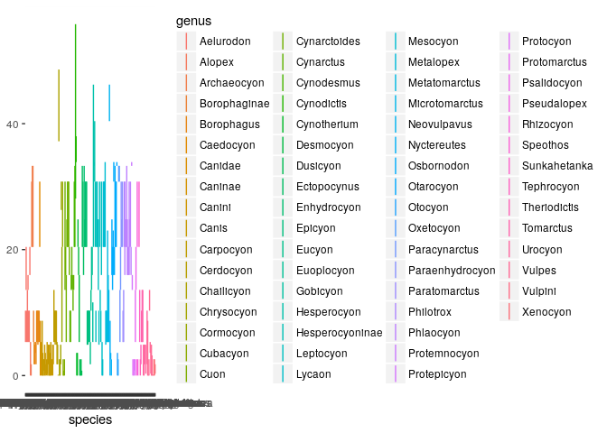
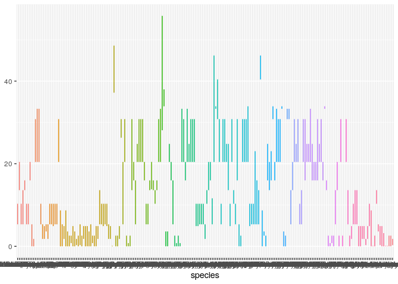
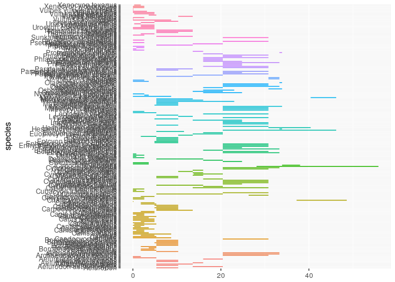
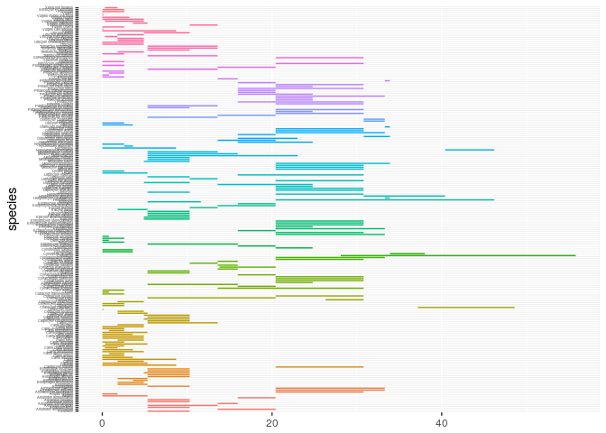
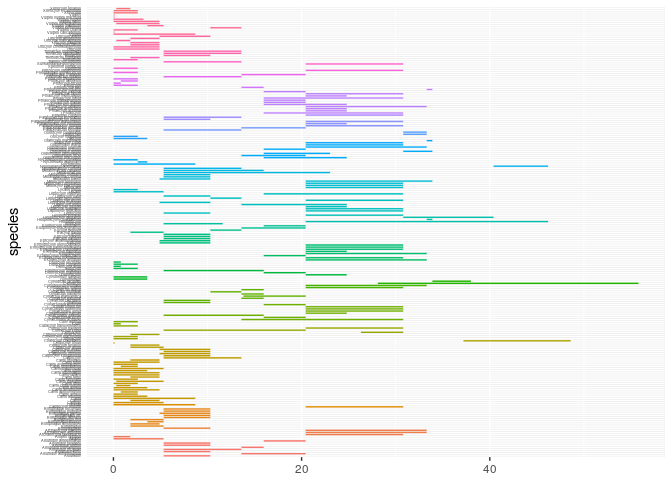
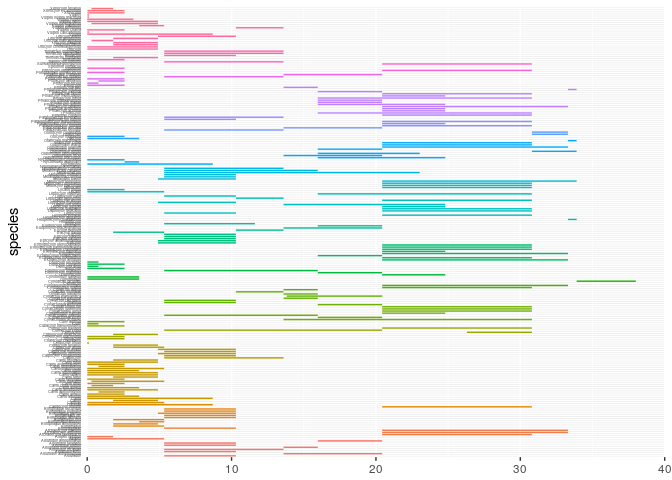
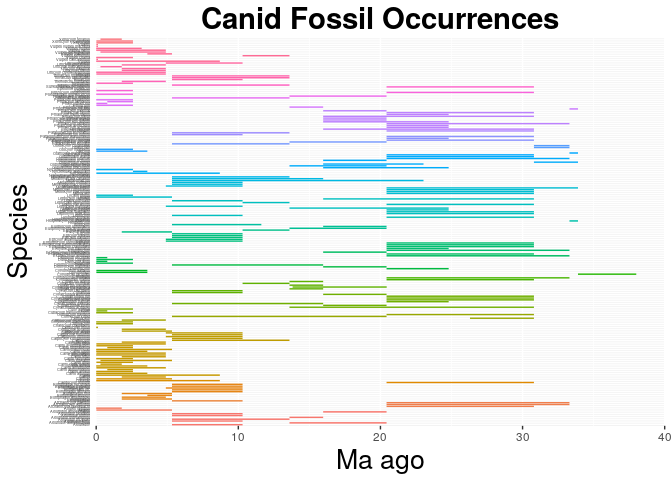

    library(ggplot2)

    setwd("/home/eeb177-student/Desktop/eeb-177/homework/") #you will need to change this to match your directory!
    canids <- read.csv("/home/eeb177-student/Desktop/eeb-177/homework/canids/sorted_canid_ranges.csv", header = F, as.is = T)
    names(canids) <- c("genus", "species", "minage", "maxage")
    head(canids)

    ##       genus                  species minage maxage
    ## 1 Aelurodon                Aelurodon   10.3  5.333
    ## 2 Aelurodon  Aelurodon asthenostylus   13.6 20.430
    ## 3 Aelurodon          Aelurodon ferox   10.3  5.333
    ## 4 Aelurodon        Aelurodon mcgrewi   13.6  5.333
    ## 5 Aelurodon    Aelurodon montanensis   13.6 15.970
    ## 6 Aelurodon       Aelurodon stirtoni   10.3  5.333

    canid_occ <- ggplot(canids, aes( species, ymin = maxage, ymax=minage, colour = genus))
    canid_occ <- canid_occ + geom_linerange()
    canid_occ

    canid_occ <- canid_occ + theme(legend.position="none")
    canid_occ

    canid_occ <- canid_occ + coord_flip()
    canid_occ

    canid_occ <- canid_occ +  theme(axis.text.y = element_text(size=3))
    canid_occ

    canid_occ <- canid_occ + theme(axis.ticks.y=element_blank())
    canid_occ

    canid_occ <- canid_occ + scale_y_continuous(limits=c(0, 40), expand = c(0, 0), breaks=c(0, 10, 20, 30, 40))
    canid_occ

    ## Warning: Removed 5 rows containing missing values (geom_linerange).

    canid_occ <- canid_occ + labs(title = "Canid Fossil Occurrences", x = "Species", y = "Ma ago") + theme(plot.title = element_text(hjust = 0.5, size=22, face = "bold"), axis.title =element_text(size=20))
    canid_occ

    ## Warning: Removed 5 rows containing missing values (geom_linerange).

    ggsave(filename = "canid-occ.pdf", plot = canid_occ)

    ## Saving 7 x 5 in image

    ## Warning: Removed 5 rows containing missing values (geom_linerange).

Questions: 1.Canids 2.211 different occurances of species 3.65 different
genera
`eeb177-student@eeb177-VirtualBox:~/Desktop/eeb-177/homework/canids$ cut -f1 -d " " sorted_canid_ranges.csv | uniq -c | wc -l`
4. based on the pdf image Metalopex merriami

Part 2
------

Exploring Data Frames

    df <- data.frame(first = c('Kristen'),
                     last = c('Lee'),
                     lucky_number = c(22),
                     stringsAsFactors = FALSE)
    df <- rbind(df, list('Sabrina', 'Cooper', 25) )
    df <- cbind(df, coffeebreak = c("YES","NO"))
    df

    ##     first   last lucky_number coffeebreak
    ## 1 Kristen    Lee           22         YES
    ## 2 Sabrina Cooper           25          NO
